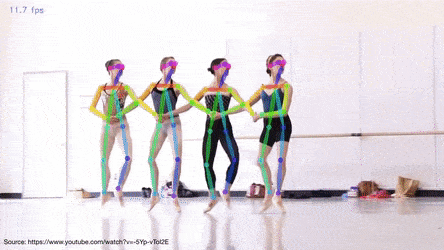

# About WonderTree

WonderTree makes interactive games for motor, academic & cognitive development & education of kids with special needs through Augmented Reality and Artificial Intelligence. you can learn more about WonderTree through this link https://wondertree.co

# Introduction

Pose estimation refers to computer vision algorithms that detect humans in images and video, so that one could determine, for example, where someone’s elbow shows up in an image. The algorithm is simply estimating where key body joints are.

PoseCamea is real time human pose estimation software which uses Pose estimation algorithm/techniques on webcam.

PoseCamera SDK provides different api to detect and process human pose on image/videos. This is also available in different programming lanaguges. Currently it supports *Python, C++ and C# *
