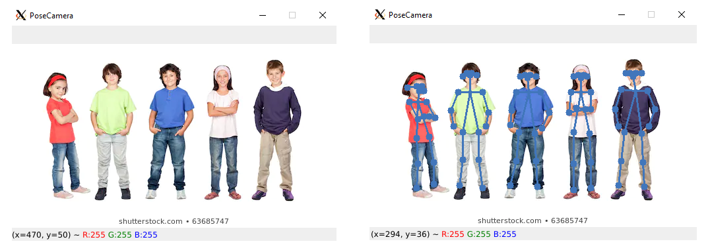

# Getting Started

PoseCamera is multi human pose estimation software based on Openpose architecture. It's written in PyTorch deep learning framework & optimized to run in low-end devices.

## Prerequisite
* Python >= 3.6
* [CUDA 10.1](https://developer.nvidia.com/cuda-downloads) and [cudnn](https://developer.nvidia.com/cudnn)

## Installation
install posecamera package through pip
```
pip install posecamera
```

If you are installation on Windows OS please see some [troubleshoots](https://wonder-tree.github.io/PoseCamera/#/pages/troubleshooting) 

### How to use

draw pose keypoints on image

```python
import posecamera
import cv2

posecamera.load("__pretrained_wights_file_path")

image = cv2.imread("example.jpg")
poses = posecamera.estimate(image)
for pose in poses:
    pose.draw(image)

cv2.imshow("PoseCamera", image)
cv2.waitKey(0)
```

> Download Pretrained weights file from https://storage.googleapis.com/wt_storage/checkpoint_iter_50000.pth

output of the above example


